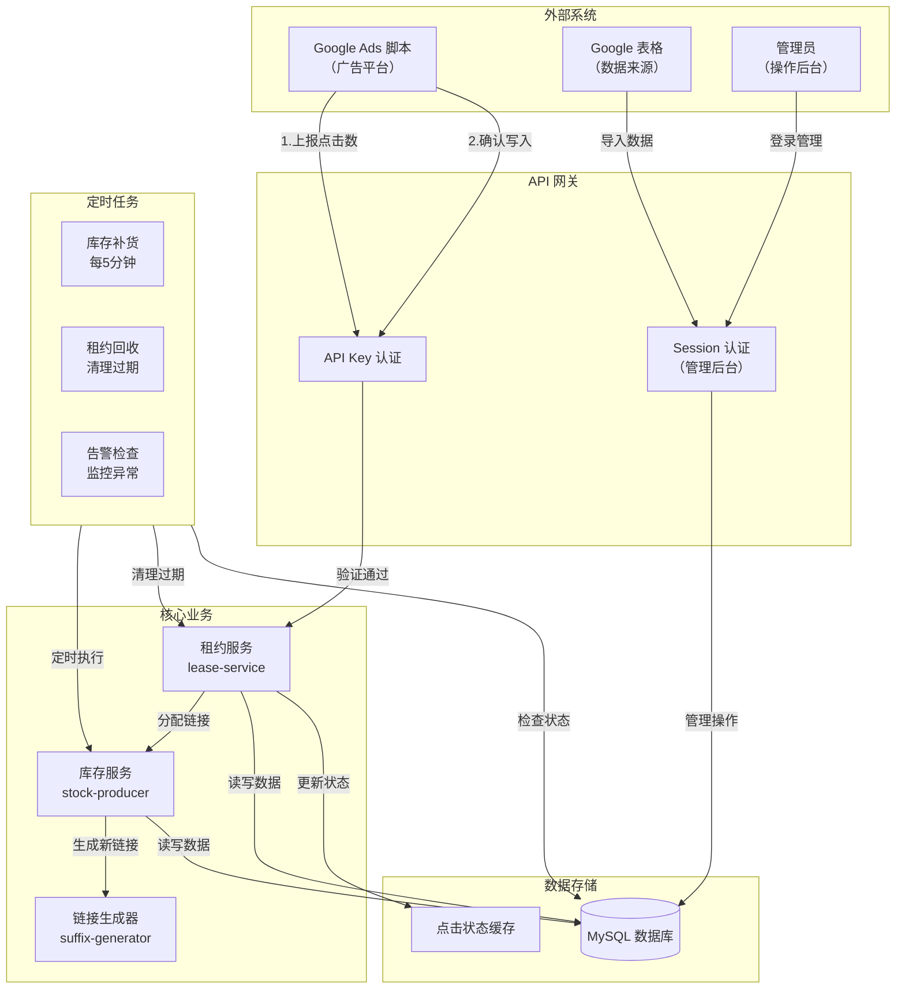
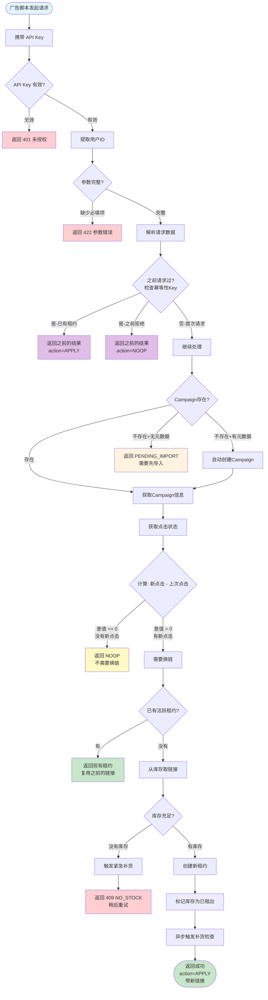
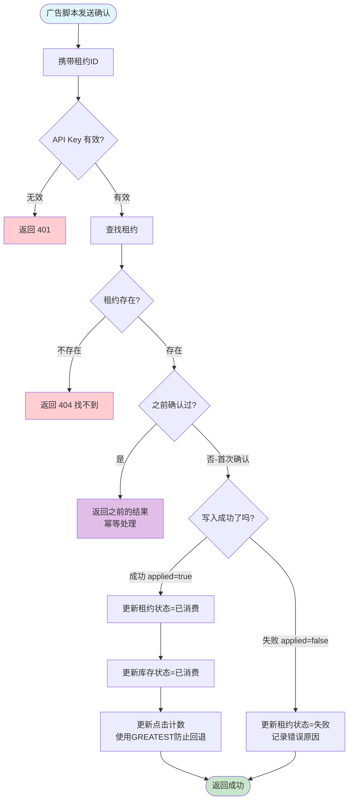
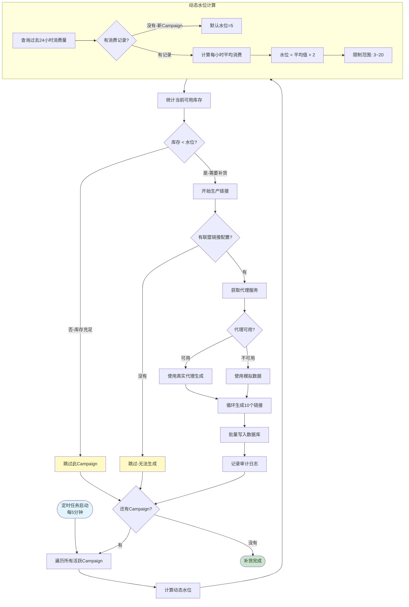
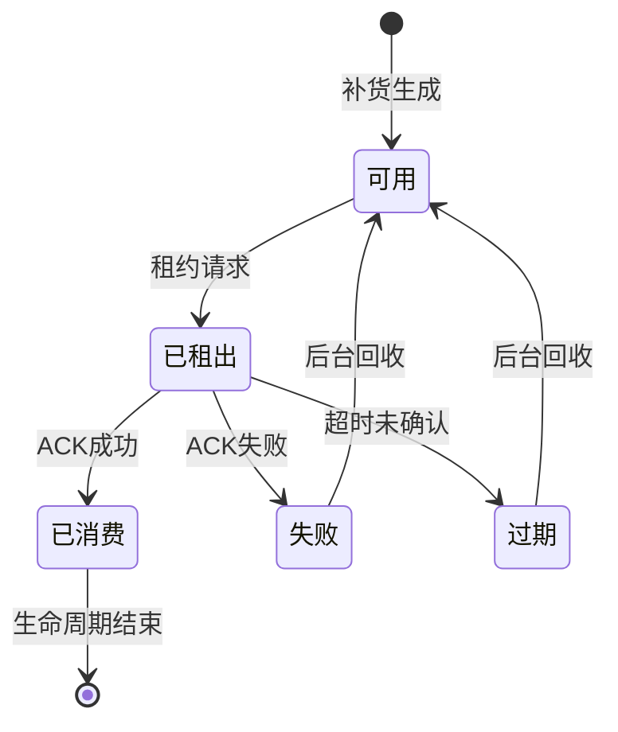
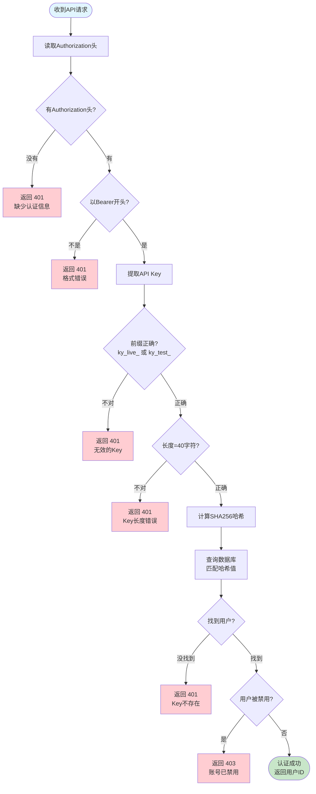
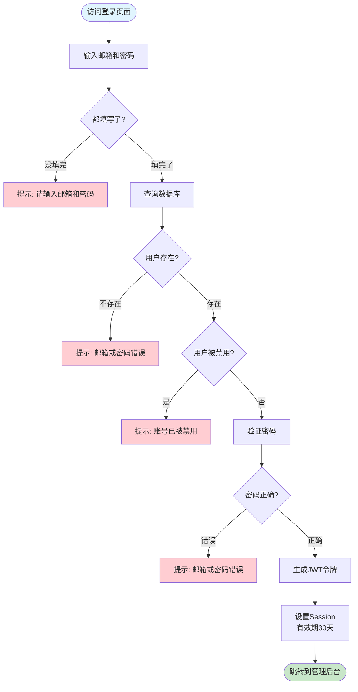
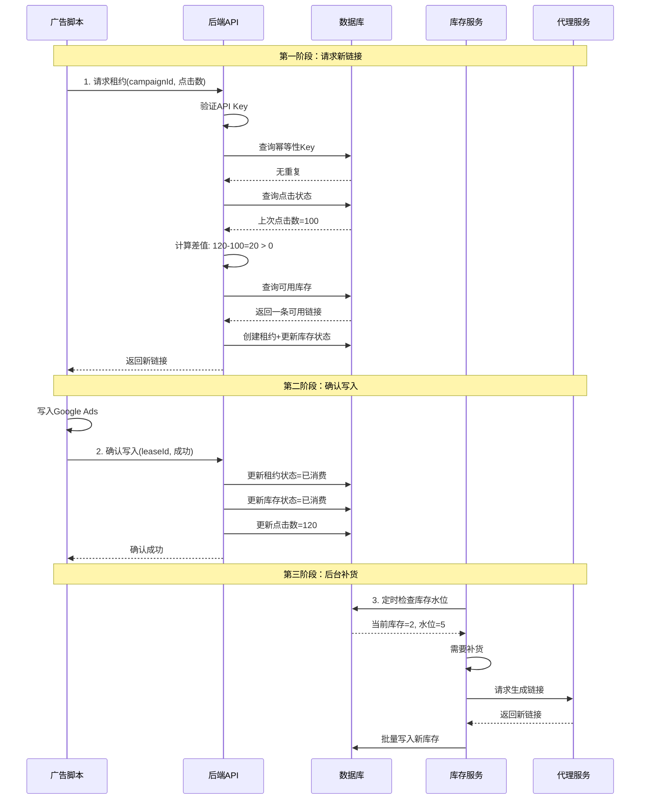
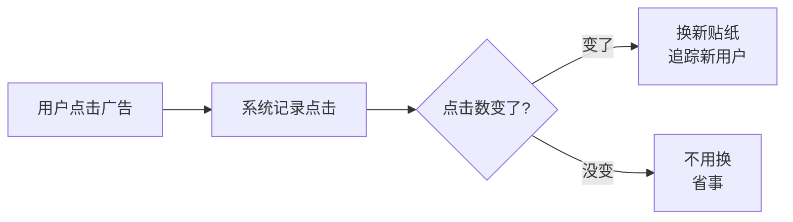
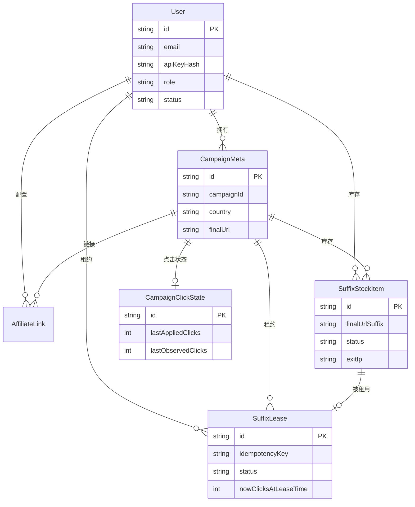

# KyAds SuffixPool 系统流程图

为项目制作小学生都能看懂的 Mermaid 流程图，涵盖四个核心模块。

---

## 1. 系统全景图



---

## 2. 核心租约流程（最重要）

### 2.1 请求租约流程



### 2.2 确认租约流程（ACK）



---

## 3. 库存补货流程



### 3.1 库存状态流转



---

## 4. 用户认证流程

### 4.1 API Key 认证（给广告脚本用）



### 4.2 管理后台登录（给管理员用）



---

## 5. 完整业务时序图



---

## 6. 小学生版本解释

### 6.1 整个系统像什么？

想象一个**自动换贴纸的机器**：

```
┌─────────────────────────────────────────────────┐
│                                                 │
│    📱 广告牌 (Google Ads)                       │
│    上面贴着一张贴纸（链接）                      │
│                                                 │
│         ↓ 有人看了广告（点击）                  │
│                                                 │
│    🤖 机器人检查：                              │
│       "有新的人看了吗？"                        │
│         ↓                                       │
│       ├── 没有新人看 → 不换贴纸                │
│       └── 有新人看 → 换一张新贴纸              │
│                                                 │
│    📦 贴纸仓库：                                │
│       - 自动检查还剩多少贴纸                    │
│       - 快用完时自动生产新的                    │
│                                                 │
└─────────────────────────────────────────────────┘
```

### 6.2 为什么要换贴纸？



### 6.3 关键规则（简单版）

| 规则名称 | 小学生解释 |
|---------|-----------|
| **幂等性** | 问同样的问题，给同样的答案（不会重复发贴纸） |
| **单租约** | 一次只能借一张贴纸，用完还了才能借下一张 |
| **单调递增** | 点击数只能变多，不能变少（防止作弊） |
| **动态水位** | 用得快就多准备，用得慢就少准备（不浪费） |

---

## 7. 数据库表关系



---

## 验证方式

流程图创建后，可以通过以下方式验证：

1. **在线预览**：将 Mermaid 代码粘贴到 [mermaid.live](https://mermaid.live) 查看渲染效果

2. **导出为图片**：使用 Mermaid CLI 或在线工具导出 PNG/SVG

3. **嵌入文档**：GitHub/GitLab/Notion 等平台原生支持 Mermaid 渲染
